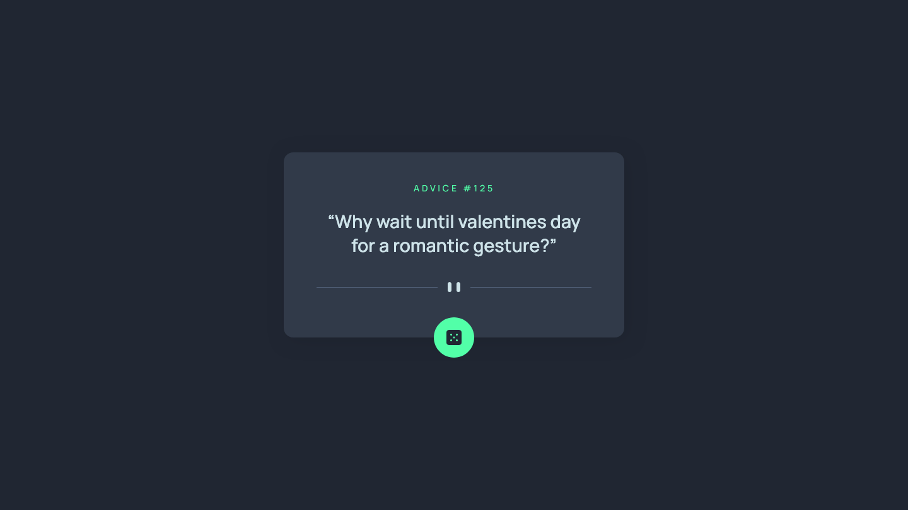

# Frontend Mentor - Advice Generator Solution

This is a solution to the [Advice Generator](https://www.frontendmentor.io/challenges/advice-generator-app-QdUG-13db). Frontend Mentor challenges help you improve your coding skills by building realistic projects. 

## Overview

### Links

- Solution URL: [Code solution](https://github.com/DanijelAdrinek/Advice-Generator)
- Live Site URL: [Live site](https://danijeladrinek.github.io/Advice-Generator/)

### Built with

- Semantic HTML5 markup
- CSS custom properties
- Mobile-first workflow
- js OOP concepts
- JSDoc

